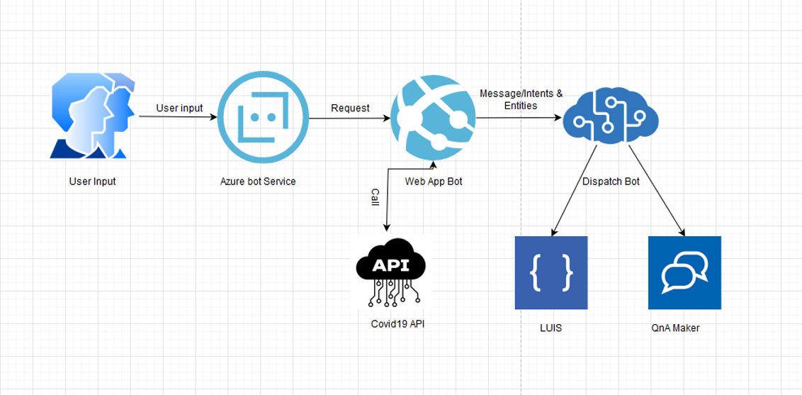

# *WIP*
 
# Covid-19 Chatbot using Microsoft Azure Bot Framework, Luis and QnAmaker
It is very likely that while visiting websites, you would have come across chatbots popping up on the bottom right of the webpage and trying to engage you in a conversation. And it is much more likely that you would have actually conversated with these bots to get some information you were looking for. Since chatbots can carry out automated natural language conversations with humans, they have become very popular in the last few years with the growth of artificial intelligence.

## Solution Architecture

### Integrating LUIS and QnA Maker (Azure Cognitive Services)
The cool thing about Microsoft Bot Service is that its chatbots can be seamlessly integrated with Microsoft Cognitive Service to enrich the bot’s ability to converse with humans in a more natural way.

There are two main cognitive services that are generally used with the bot service - Language Understanding Intelligent Service (LUIS) and QnA Maker. The purpose of LUIS is to help chatbot understand the intent of the user using which it can fetch the appropriate task flow or API to derive the response. QnA maker is useful when the question asked is simple and the answer can be fetched from a knowledge base that is usually static.

Although it is advisable to use either of LUIS or QnA Maker in the chatbot design, you can use both services as well if the knowledge base is not complete or chatbot needs more information during a conversation. In this case, a Dispatcher tool is used to determine which of the two services needs to be invoked during the course of conversation.

### Prerequisite
1) [.NET Core SDK version 3.1](https://dotnet.microsoft.com/download)
2) C# Programming Knowledge
3) [Azure Subscription account](portal.azure.com)
4) Visual Studio 2017/ [Visual studio code](https://code.visualstudio.com/)
5) [LUIS Account](luis.ai.com)
6) [QnaMaker Account](qnamaker.ai)
7) [Bot Framework V4](https://dev.botframework.com/)
8) [Covid19api API](https://covid19api.com/)
9) [Bot framework Emulator](https://github.com/Microsoft/BotFramework-Emulator/releases/tag/v4.8.1)
10) [Adaptive cards](https://adaptivecards.io/)

### Limitations and Considerations

This is a demo to showcase a Bot Framework, Luis and QnA maker use case.  It is not intended to be a framework or scalable architecture for all scenarios, though it can give you an idea of what your scenario might end up looking like.

### Debugging

If you encounter issues running this demo, there are several ways you can debug what may be wrong.
Ensure that you AppID and Password is defined in the appsetting.json file 
