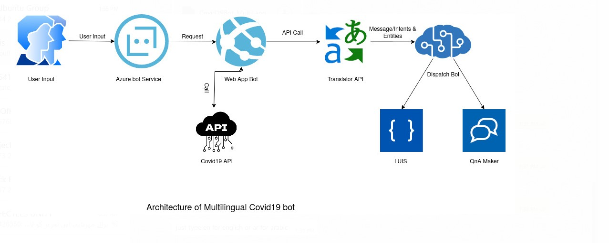
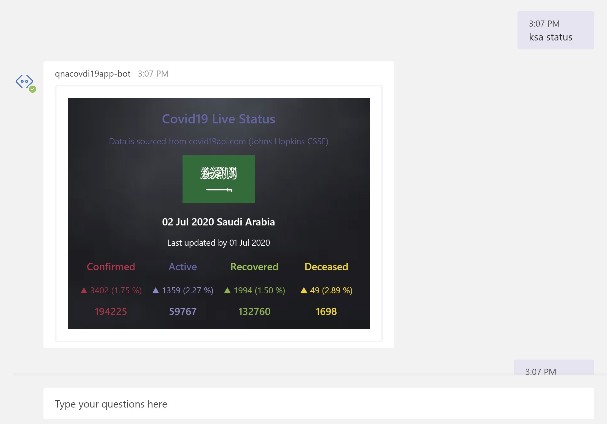
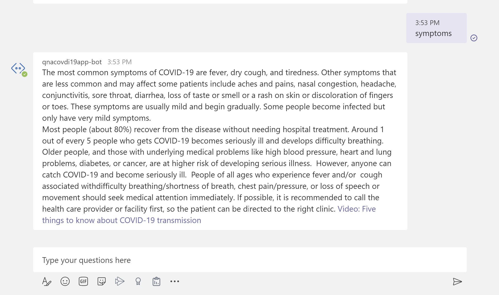

# *WIP*
 
# Covid-19 Chatbot using Microsoft Azure Bot Framework and Cognitive Services ( Luis,QnAmaker, and Text Translator)
It is very likely that while visiting websites, you would have come across chatbots popping up on the bottom right of the webpage and trying to engage you in a conversation. And it is much more likely that you would have actually conversated with these bots to get some information you were looking for. Since chatbots can carry out automated natural language conversations with humans, they have become very popular in the last few years with the growth of artificial intelligence.

## Solution Architecture


### Integrating LUIS and QnA Maker (Azure Cognitive Services)
The cool thing about Microsoft Bot Service is that its chatbots can be seamlessly integrated with Microsoft Cognitive Service to enrich the bot’s ability to converse with humans in a more natural way.

There are two main cognitive services that are generally used with the bot service - Language Understanding Intelligent Service (LUIS) and QnA Maker. The purpose of LUIS is to help chatbot understand the intent of the user using which it can fetch the appropriate task flow or API to derive the response. QnA maker is useful when the question asked is simple and the answer can be fetched from a knowledge base that is usually static.

Although it is advisable to use either of LUIS or QnA Maker in the chatbot design, you can use both services as well if the knowledge base is not complete or chatbot needs more information during a conversation. In this case, a Dispatcher tool is used to determine which of the two services needs to be invoked during the course of conversation.

### Prerequisite
1) [.NET Core SDK version 3.1](https://dotnet.microsoft.com/download)
2) C# Programming Knowledge
3) [Azure Subscription account](portal.azure.com)
4) Visual Studio 2017/ [Visual studio code](https://code.visualstudio.com/)
5) [LUIS Account](luis.ai.com)
6) [QnaMaker Account](qnamaker.ai)
7) [Bot Framework V4](https://dev.botframework.com/)
8) [Covid19api API](https://covid19api.com/)
9) [Bot framework Emulator](https://github.com/Microsoft/BotFramework-Emulator/releases/tag/v4.8.1)
10) [Adaptive cards](https://adaptivecards.io/)

## To try this sample

- Clone the repository

    ```bash
    git clone https://github.com/Hrashid789/Covid-19Bot .git
    ```

- In a terminal, navigate to `samples/csharp_dotnetcore/17.multilingual-bot`
- Run the bot from a terminal or from Visual Studio, choose option A or B.

  A) From a terminal

  ```bash
  # run the bot
  dotnet run
  ```

  B) Or from Visual Studio

  - Launch Visual Studio
  - File -> Open -> Project/Solution
  - Navigate to `samples/Chatbot/qnacovdi19app_1.0/qnacovdi19app/qnacovdi19app-bot-src1` folder
  - Select `QnABot.csproj` file
  - Press `F5` to run the project

### Deploy Required Resources

1. Click the below button to upload the provided ARM template to the Azure portal, which is written to automatically deploy and configure the following resources:
    1. An Azure Bot service, default set to [Standard](https://azure.microsoft.com/en-us/pricing/details/bot-service/) tier.
    2. An Cognitive Service (LUIS), default set to [Free](https://azure.microsoft.com/en-us/pricing/details/cognitive-services/language-understanding-intelligent-services/) tier.
    3. An Cognitive Service (QnAMaker), default set to [Free](https://azure.microsoft.com/en-us/pricing/details/cognitive-services/qna-maker/) tier.
    4. An Azure Web App Service, using the plan from # 3.
    5. A Cognitive Services account, of type [CognitiveServices](https://azure.microsoft.com/en-us/pricing/details/cognitive-services/), that will be used for billing your Cognitive Search skills usage.

    </br>
    <a href="https://portal.azure.com/#create/Microsoft.Template/uri/https://raw.githubusercontent.com/Hrashid789/Covid-19Bot/blob/master/AzureDeploy.json" target="_blank">
        
    </a>


## Testing the bot using Bot Framework Emulator

[Bot Framework Emulator](https://github.com/microsoft/botframework-emulator) is a desktop application that allows bot developers to test and debug their bots on localhost or running remotely through a tunnel.

- Install the Bot Framework Emulator version 4.3.0 or greater from [here](https://github.com/Microsoft/BotFramework-Emulator/releases)

### Connect to the bot using Bot Framework Emulator

- Launch Bot Framework Emulator
- File -> Open Bot
- Enter a Bot URL of `http://localhost:3978/api/messages`

## Integrating with Microsoft Teams
### Follow this step-by-step [guide](https://docs.microsoft.com/en-us/azure/bot-service/channel-connect-teams?view=azure-bot-service-4.0) to integrate your chatbot with Microsoft Teams

 


 
### Limitations and Considerations

This is a demo to showcase a Bot Framework, Luis and QnA maker use case.  It is not intended to be a framework or scalable architecture for all scenarios, though it can give you an idea of what your scenario might end up looking like.

### Debugging

If you encounter issues running this demo, there are several ways you can debug what may be wrong.
Ensure that you AppID and Password is defined in the appsetting.json file 

## Deploy the bot to Azure

To learn more about deploying a bot to Azure, see [Deploy your bot to Azure](https://aka.ms/azuredeployment) for a complete list of deployment instructions.

## Further reading

- [Bot Framework Documentation](https://docs.botframework.com)
- [Bot Basics](https://docs.microsoft.com/azure/bot-service/bot-builder-basics?view=azure-bot-service-4.0)
- [Dialogs](https://docs.microsoft.com/en-us/azure/bot-service/bot-builder-concept-dialog?view=azure-bot-service-4.0)
- [Gathering Input Using Prompts](https://docs.microsoft.com/en-us/azure/bot-service/bot-builder-prompts?view=azure-bot-service-4.0&tabs=csharp)
- [Activity processing](https://docs.microsoft.com/en-us/azure/bot-service/bot-builder-concept-activity-processing?view=azure-bot-service-4.0)
- [Azure Bot Service Introduction](https://docs.microsoft.com/azure/bot-service/bot-service-overview-introduction?view=azure-bot-service-4.0)
- [Azure Bot Service Documentation](https://docs.microsoft.com/azure/bot-service/?view=azure-bot-service-4.0)
- [.NET Core CLI tools](https://docs.microsoft.com/en-us/dotnet/core/tools/?tabs=netcore2x)
- [Azure CLI](https://docs.microsoft.com/cli/azure/?view=azure-cli-latest)
- [Azure Portal](https://portal.azure.com)
- [Language Understanding using LUIS](https://docs.microsoft.com/en-us/azure/cognitive-services/luis/)
- [Channels and Bot Connector Service](https://docs.microsoft.com/en-us/azure/bot-service/bot-concepts?view=azure-bot-service-4.0)
